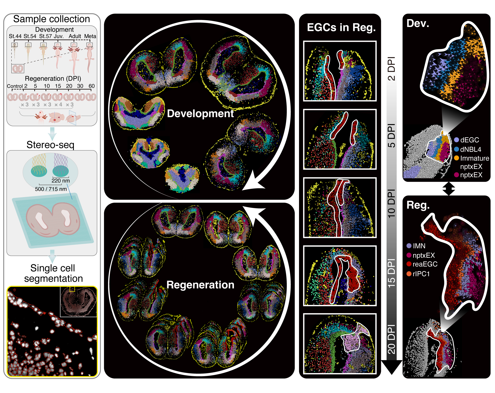

# Axolotl Regenerative Telencehpalon Interpretation via Spatiotemporal Transcriptomic Atlas

This repository contains scripts used in the analysis of the manuscript: ["Single-cell Stereo-seq reveals key progenitor cells involved in axolotl forebrain regeneration"](https://doi.org/10.1101/somewhere), and [here](https://www.biorxiv.org/content/10.1101/2021.10.23.465550v2) is a pre-printed version in bioRxiv.

Raw and processed data can be explored and downloaded in our database [ARTISTA](https://db.cngb.org/stomics/artista/).